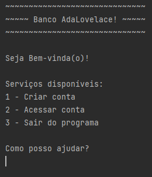
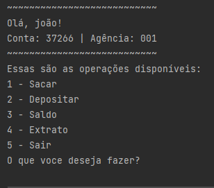

# Bank App

### This is a command-line bank simulator application.

This app simulates a bank with basic operations: `Withdraw` and `Deposit`. Also, it allows to create multiple accounts 
and save them in a list.  
It was built using only Java, meaning the app doesn't have a database connection, so all data is lost after the app is 
closed. I may be adding a database connection later on.

When the application starts it shows this menu:

    

`1 - Criar conta`
Creates an account and it only requires a name.

`2 - Acessar conta`
If you want to log in to your account. It requires the account number.

`3 - Sair do programa`
Closes the application.

    

`1 - Sacar`
Allows you to withdraw the money.

`2 - Depositar`
This option allows you to Deposit into your account.

`3 - Saldo`
Show the account's balance.

`4 - Extrato`
Here you can consult the account logs.

`5 - Sair`
Logs out of the account.